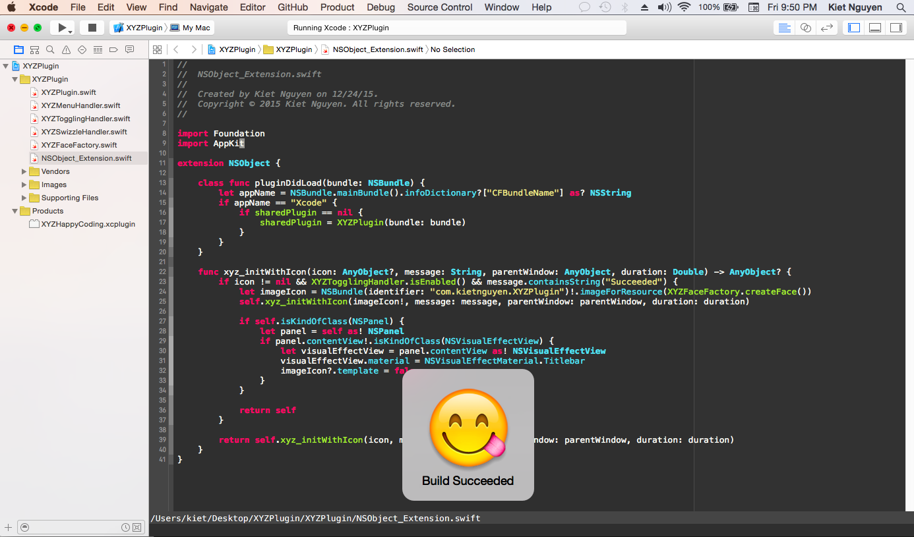

# XYZHappyCoding

# Features
- Every time a build succeeds, a happy face comes
- Toggle via `Edit -> Happy Coding`

## Credit
- Credit goes to [How To Create an Xcode Plugin: Part 1/3](http://www.raywenderlich.com/94020/creating-an-xcode-plugin-part-1)

## Author

Kiet Nguyen - iOS blogger at http://vankiet.com/

## License

XYZHappyCoding is available under the MIT license. See the LICENSE file for more info.
